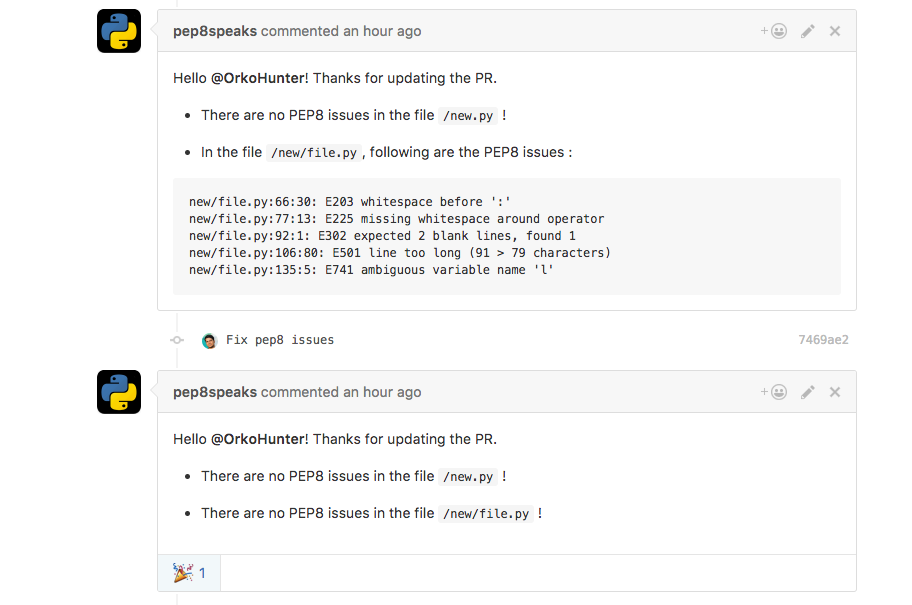
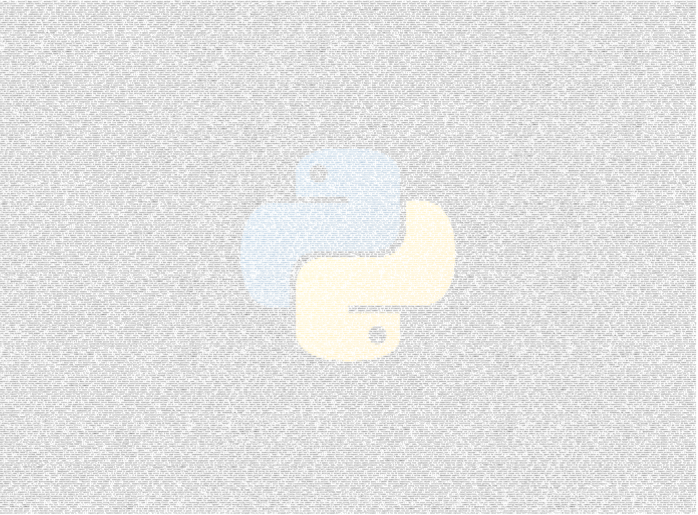

# PEP8 Speaks
> because it matters.

A GitHub :octocat: integration to automatically review Python code style over Pull Requests



# How to Use?

 - Go to the homepage of the [Integration](https://github.com/integration/pep8-speaks)
 - Click on Install button
 - Add the repositories you want this service for

# Features

 - To pause the bot from commenting on a PR, comment `@pep8speaks Keep Quiet.`
 - Comment `@pep8speaks Resume now.` to resume.
  - The keywords are `quiet` and `resume` and the mention of the bot.
 - The bot's last comment is not repeated. Hence if the PR is updated and the bot does not comment, it means it stands with its previous comment.
 - Mention `@pep8speaks` in a review summary while creating a review of a PR, and it will comment a gist of diff suggesting fixes for the PR. [Example](https://github.com/OrkoHunter/test-pep8speaks/pull/22#issuecomment-270826241)
  - In the review summary, you can also write `@pep8speaks suggest diff` or anything you wish, as long as you mention the bot.
 - Write `@pep8speaks pep8ify` in a review summary and it will create a Pull Request with changes suggested by [`autopep8`](https://github.com/hhatto/autopep8) against the branch of the author of the PR. `autopep8` fixes most of the errors reported by [`pycodestyle`](https://github.com/PyCQA/pycodestyle).
  - `@pep8speaks` along with `pep8ify` in a single review summary rules out the diff feature.
 - Comment only if Python files are involved. So, install the integration on all of your repositories. The bot won't speak where it should not

# Configuration
A config file is *not required* for the integration to work. However it can be configured additionally by adding a `.pep8speaks.yml` file to the base directory of the repo. Here are the available options of the config file :

```yaml
# File : .pep8speaks.yml

message:  # Customize the comment made by the bot
    opened:  # Messages when a new PR is submitted
        header: "Hello @{name}, Thank you for submitting the Pull Request !"
                # The keyword {name} is converted into the author's username
        footer: "Do see the [Hitchhiker's guide to code style](https://goo.gl/hqbW4r)"
                # The messages can be written as they would over GitHub
    updated:  # Messages when new commits are added to the PR
        header: "Hello @{name}, Thank you for updating !"
        footer: ""  # Why to comment the link to the style guide everytime? :)

scanner:
    diff_only: False  # If True, errors caused by only the patch are shown

pycodestyle:
    max-line-length: 100  # Default is 79 in PEP8
    ignore:  # Errors and warnings to ignore
        - W391
        - E203
```

Note : See more [pycodestyle options](https://pycodestyle.readthedocs.io/en/latest/intro.html#example-usage-and-output)

# How to fix?

 - Check the errors locally by the command line tool [pycodestyle](https://github.com/PyCQA/pycodestyle) (previously known as `pep8`).
 - [autopep8](https://github.com/hhatto/autopep8) is another command line tool to fix the issues.

## Media

 - [Product Hunt](https://www.producthunt.com/posts/pep8-speaks)

# Contribute

This is a very young project. If you have got any suggestions for new features or improvements, please comment over [here](https://github.com/OrkoHunter/pep8speaks/issues/1). Pull Requests are most welcome !

:heart:

<br>
###### Created using [commits.io](https://commits.io)
