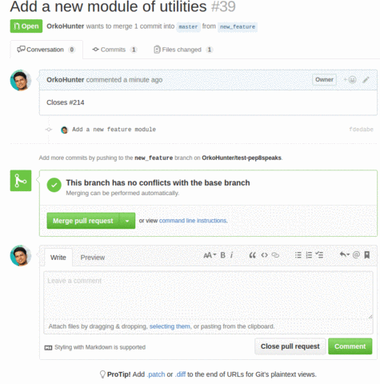

# PEP 8 Speaks

  <a href="https://kuma.fosscu.org/status/pep8speaks" target="_blank"></a>

A GitHub :octocat: app to automatically review Python code style over Pull Requests

<p align="center">
    
</p>

# Table of Contents

- [Installation](#installation)
- [Example](#example)
- [Main features](#main-features)
- [Configuration](#configuration)
- [Popular Users](#popular-users)
- [Miscellaneous features](#miscellaneous-features)
- [Private repos](#private-repos)
- [How to fix PEP 8 issues?](#how-to-fix-pep-8-issues)
- [Release announcements](#release-announcements)
- [Contributing](#contributing)
- [Updates](#updates)

# Installation

- Go to the homepage of the app - https://github.com/apps/pep8-speaks
- Click on the Configure button
- Add repositories or organizations to activate PEP 8 Speaks

# Example



# Main features

- The bot makes **a single comment on the Pull Request and keeps updating it** on new commits. No hustle on emails !
- The bot **comments only if Python files are involved**. So, install the integration on all of your repositories. The bot would not comment where it should not.
- By default, the bot does not comment if there are no PEP 8 issues. You can change this in configuration.
- **You can use choose between `pycodestyle` or `flake8` as your linter.** The bot can read configurations for both.
- The bot can read your `setup.cfg` for `[flake8]` and `[pycodestyle]` sections. Check out the `Configuration` section below.

# Configuration

**A config file is not required for the integration to work**. However it can be configured additionally by adding a `.pep8speaks.yml` file in the root of the project. Here is an example :

```yaml
# File : .pep8speaks.yml

scanner:
  diff_only: True # If False, the entire file touched by the Pull Request is scanned for errors. If True, only the diff is scanned.
  linter: pycodestyle # Other option is flake8

pycodestyle: # Same as scanner.linter value. Other option is flake8
  max-line-length: 100 # Default is 79 in PEP 8
  ignore: # Errors and warnings to ignore
    - W504 # line break after binary operator
    - E402 # module level import not at top of file
    - E731 # do not assign a lambda expression, use a def
    - C406 # Unnecessary list literal - rewrite as a dict literal.
    - E741 # ambiguous variable name

no_blank_comment: True # If True, no comment is made on PR without any errors.
descending_issues_order: False # If True, PEP 8 issues in message will be displayed in descending order of line numbers in the file

message: # Customize the comment made by the bot
  opened: # Messages when a new PR is submitted
    header:
      "Hello @{name}! Thanks for opening this PR. "
      # The keyword {name} is converted into the author's username
    footer:
      "Do see the [Hitchhiker's guide to code style](https://goo.gl/hqbW4r)"
      # The messages can be written as they would over GitHub
  updated: # Messages when new commits are added to the PR
    header: "Hello @{name}! Thanks for updating this PR. "
    footer: "" # Why to comment the link to the style guide everytime? :)
  no_errors: "There are currently no PEP 8 issues detected in this Pull Request. Cheers! :beers: "
```

**Notes:**

- Default settings are in [data/default_pep8speaks.yml](/data/default_pep8speaks.yml). Your `.pep8speaks.yml` will override these values.
- For every Pull Request, the bot looks for `.pep8speaks.yml` in the `base` branch (the existing one). If the file is not found, it then searches the `head` branch (the incoming changes).
- Set the value of `scanner.linter` to either `pycodestyle` or `flake8`
  - flake8 is a wrapper around pycodestyle with additional enforcements.
- For linter configurations (like `ignore` or `max-line-length`), PEP8Speaks will look and prioritize configurations in the following order :
  - `pycodestyle:` or `flake8:` section of `.pep8speaks.yml`.
    - This depends upon the `scanner.linter` value.
  - `[pycodestyle]` or `[flake8]` section of `setup.cfg` file in the root of the project.
    - This is independent of `scanner.linter`. So, `[flake8]` section of `setup.cfg` will also work for pycodestyle.
- Read more on [pycodestyle](http://pycodestyle.pycqa.org/en/latest/) and [flake8](http://flake8.pycqa.org/en/latest/) documentation.

# Popular Users

|                                                                                                                                     | Organization                                                               | Description                                                  |
| ----------------------------------------------------------------------------------------------------------------------------------- | -------------------------------------------------------------------------- | ------------------------------------------------------------ |
|                                               | [Pandas](https://github.com/pandas-dev/pandas)                             | Powerful data manipulation tools for Python                  |
|                                                 | [Adobe](https://github.com/adobe)                                          | Open source from Adobe                                       |
|                                                 | [openSUSE](https://github.com/openSUSE)                                    | Linux distribution                                           |
|                                               | [PyTorch Lightning](https://github.com/PyTorchLightning/pytorch-lightning) | The lightweight PyTorch wrapper for ML researchers.          |
|                                                 | [NetworkX](https://github.com/NetworkX/NetworkX)                           | Python library for graph theory and complex networks         |
|                                                 | [Statsmodels](https://github.com/statsmodels/statsmodels)                  | Statistical modeling and econometrics in Python              |
|                                                | [xarray (PyData)](https://github.com/pydata/xarray)                        | N-D labeled arrays and datasets in Python (Python for Data)  |
|                         | [SunPy](https://github.com/sunpy)                                          | Python for Solar Physics                                     |
|                                                 | [Astropy](https://github.com/astropy)                                      | Astronomy in Python                                          |
|                                               | [Scikit Learn Contrib](https://github.com/scikit-learn-contrib)            | scikit-learn compatible projects                             |
|                        | [Scikit Image](https://github.com/scikit-image)                            | Image processing in Python                                   |
|                       | [Spyder IDE](https://github.com/spyder-ide/spyder)                         | The Scientific Python Development Environment                |
|  | [Catalyst](https://github.com/catalyst-team/catalyst)                      | PyTorch framework for Deep Learning research and development |

See the [complete list of organizations and users](https://github.com/OrkoHunter/pep8speaks/wiki/List-of-users-and-orgs).

# Miscellaneous features

- Comment `@pep8speaks suggest diff` in a comment of the PR, and it will comment a gist of diff suggesting fixes for the PR. [Example](https://github.com/OrkoHunter/test-pep8speaks/pull/22#issuecomment-270826241)
- Comment `@pep8speaks pep8ify` on the PR and it will create a Pull Request with changes suggested by [`autopep8`](https://github.com/hhatto/autopep8) against the branch of the author of the PR. `autopep8` fixes most of the errors reported by [`pycodestyle`](https://github.com/PyCQA/pycodestyle).
- Add `[skip pep8]` anywhere in the commit message, PR title or PR description to prohibit pep8speaks from commenting on the Pull Request.

# Private repos

This app will only work for publicly hosted repositories. So if you are looking to deploy a fork or **use the app for private repositories**, [here are the instructions](https://github.com/OrkoHunter/pep8speaks/wiki/Instructions-to-deploy-a-fork).

# How to fix PEP 8 issues?

- Check the errors locally by the command line tool [pycodestyle](https://github.com/PyCQA/pycodestyle) (previously known as `pep8`).
- [autopep8](https://github.com/hhatto/autopep8) is another command line tool to fix the issues.
- Also, see [black](https://github.com/ambv/black)

# Release announcements

Updates to the app are announced using the GitHub Release feature over [here](https://github.com/OrkoHunter/pep8speaks/releases). A lot of major changes are made as the community grows bigger. Click on `Watch` -> `Releases only` on top of the page, to get notified about new configurations or feature updates.

Usually, the master branch is deployed as soon as Pull Requests are merged in the repository. However, on every Friday, I make a release and make sure the latest code is deployed. You do not need to do anything to use the latest version. If you use a fork of PEP 8 Speaks, check out the Release space.

<h2 align="center">Sponsors</h2>

[Become a Gold Sponsor](https://github.com/OrkoHunter/pep8speaks/wiki/Funding#how-to-donate) and get your logo and name with a link to your site on our README and our [website](https://pep8speaks.org).

<table>
  <tbody>
    <tr>
      <td align="center" valign="top">
        <a href="https://www.samagragovernance.in/">
          
          <br><br>
          <p>Samagra Governance</p>
        </a>
      </td>
      <td align="center" valign="top">
        <a href="https://github.com/Samagra-Development">
          
          <br><br>
          <p>SamagraX</p>
        </a>
      </td>
    </tr>
</tbody>
</table>

<h2 align="center">Previous Sponsors</h2>

<h4 align="center">Gold Sponsors</h2>

[Become a Gold Sponsor](https://github.com/OrkoHunter/pep8speaks/wiki/Funding#how-to-donate) and get your logo and name with a link to your site on our README and our [website](https://pep8speaks.org).

<table>
  <tbody>
    <tr>
      <td align="center" valign="top">
        <a href="https://www.python.org/psf/">
          
          <br><br>
          <p>Python Software Foundation</p>
        </a>
      </td>
      <td align="center" valign="top">
        <a href="https://weblate.org/">
          
          <br><br>
          <p>Weblate</p>
        </a>
      </td>
    </tr>
</tbody>
</table>

<h2 align="center">Silver Sponsors</h2>

[Become a Silver Sponsor](https://github.com/OrkoHunter/pep8speaks/wiki/Funding#how-to-donate) and get your logo and name with a link to your site on our README and our [website](https://pep8speaks.org).

<table>
  <tbody>
    <tr>
      <td align="center" valign="top">
        <a href="https://ccextractor.org">
          
          <br><br>
          <p>CCExtractor</p>
        </a>
      </td>
      <td align="center" valign="top">
        <a href="https://github.com/debugger22">
          
          <br><br>
          <p>Sudhanshu Mishra</p>
        </a>
      </td>
    </tr>
</tbody>
</table>

# Contributing

You can support the project by contributing to its development. If you have any suggestions for new features or improvements, please [create an issue](https://github.com/OrkoHunter/pep8speaks/issues/new). Pull Requests are most welcome ! Read [CONTRIBUTING](/.github/CONTRIBUTING.md) doc to understand how the project works and how you can make changes.

The project requires to be hosted on a server and due to which, it needs financial support as well.

Please read the [case for funding PEP 8 Speaks](https://github.com/OrkoHunter/pep8speaks/wiki/Funding).

[](https://liberapay.com/OrkoHunter)
[](https://www.paypal.me/orkohunter)

If you use this project and you like it, [please let me know](https://saythanks.io/to/OrkoHunter). Thanks!

:heart:

<sub><sup><sub>This project does not endorse all of the rules of the original PEP 8 and thus believes in customizing pycodestyle.

<sub><sup><sub>[.](https://github.com/OrkoHunter/python-easter-eggs)

# Updates

- April 5, 2020 - [PEP8Speaks - Now helping 5,000 open source projects write neat and clean Python](https://orkohunter.net/blog/pep8speaks-5000-projects/)

# Star History

[](https://star-history.com/#pep8speaks-org/pep8speaks&Date)

# Recent Activity

<!--START_SECTION:activity-->

1. 🗣 Commented on [#3384](https://github.com/dipy/dipy/pull/3384#issuecomment-2417100232) in [dipy/dipy](https://github.com/dipy/dipy)
2. 🗣 Commented on [#16](https://github.com/eastgenomics/s3_upload/pull/16#issuecomment-2417033851) in [eastgenomics/s3_upload](https://github.com/eastgenomics/s3_upload)
3. 🗣 Commented on [#625](https://github.com/ExoCTK/exoctk/pull/625#issuecomment-2416941160) in [ExoCTK/exoctk](https://github.com/ExoCTK/exoctk)
4. 🗣 Commented on [#1573](https://github.com/Open-CAS/open-cas-linux/pull/1573#issuecomment-2416849692) in [Open-CAS/open-cas-linux](https://github.com/Open-CAS/open-cas-linux)
5. 🗣 Commented on [#31](https://github.com/Borda/pyDeprecate/pull/31#issuecomment-2416150732) in [Borda/pyDeprecate](https://github.com/Borda/pyDeprecate)
6. 🗣 Commented on [#7](https://github.com/avaframe/AmaConnector/pull/7#issuecomment-2416056600) in [avaframe/AmaConnector](https://github.com/avaframe/AmaConnector)
7. 🗣 Commented on [#2](https://github.com/eastgenomics/clinvar_submissions/pull/2#issuecomment-2416055809) in [eastgenomics/clinvar_submissions](https://github.com/eastgenomics/clinvar_submissions)
8. 🗣 Commented on [#699](https://github.com/quark-engine/quark-engine/pull/699#issuecomment-2415750246) in [quark-engine/quark-engine](https://github.com/quark-engine/quark-engine)
9. 🗣 Commented on [#532](https://github.com/payu-org/payu/pull/532#issuecomment-2415657762) in [payu-org/payu](https://github.com/payu-org/payu)
10. 🗣 Commented on [#171](https://github.com/MDAnalysis/distopia/pull/171#issuecomment-2415307553) in [MDAnalysis/distopia](https://github.com/MDAnalysis/distopia)
<!--END_SECTION:activity-->
