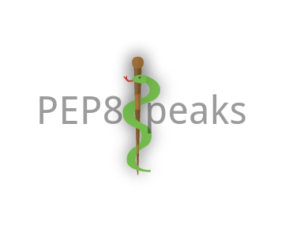

# PEP8 Speaks [](https://travis-ci.org/OrkoHunter/pep8speaks) [](https://landscape.io/github/OrkoHunter/pep8speaks/master)

A GitHub :octocat: integration to automatically review Python code style over Pull Requests

<h1 align="center"></h1>

> "PEP8 unto thyself, not unto others" - Raymond Hettinger

# Example


# How to Use?

 - Go to the homepage of the [Integration](https://github.com/integration/pep8-speaks)
 - Click on Install button
 - Add the repositories you want this service for

# Features

 - The bot makes **a single comment on the PR and keeps updating it** on new commits. No hustle on emails !
 - The bot comments only if Python files are involved. So, install the integration on all of your repositories. The bot won't speak where it should not
 - Comment `@pep8speaks suggest diff` in a comment of the PR, and it will comment a gist of diff suggesting fixes for the PR. [Example](https://github.com/OrkoHunter/test-pep8speaks/pull/22#issuecomment-270826241)
  - You can also comment `@pep8speaks suggest the diff` or anything you wish, as long as you mention the bot and have `suggest` and `diff` keywords.
 - Comment `@pep8speaks pep8ify` on the PR and it will create a Pull Request with changes suggested by [`autopep8`](https://github.com/hhatto/autopep8) against the branch of the author of the PR. `autopep8` fixes most of the errors reported by [`pycodestyle`](https://github.com/PyCQA/pycodestyle).
 - Add `[skip pep8]` anywhere in the commit message, PR title or PR description to prohibit pep8speaks to comment on the Pull Request.
 - To pause the bot on a PR, comment `@pep8speaks Keep Quiet.`
 - Comment `@pep8speaks Resume now.` to resume.
  - The keywords are `quiet` and `resume` and the mention of the bot.


# Configuration
A config file is *not required* for the integration to work. However it can be configured additionally by adding a `.pep8speaks.yml` file to the base directory of the repo. Here are the available options of the config file :

```yaml
# File : .pep8speaks.yml

message:  # Customize the comment made by the bot
    opened:  # Messages when a new PR is submitted
        header: "Hello @{name}! Thanks for opening this PR. "
                # The keyword {name} is converted into the author's username
        footer: "Do see the [Hitchhiker's guide to code style](https://goo.gl/hqbW4r)"
                # The messages can be written as they would over GitHub
    updated:  # Messages when new commits are added to the PR
        header: "Hello @{name}! Thanks for updating this PR. "
        footer: ""  # Why to comment the link to the style guide everytime? :)
    no_errors: "There are currently no PEP 8 issues detected in this Pull Request. Cheers! :beers: "

scanner:
    diff_only: False  # If True, errors caused by only the patch are shown

pycodestyle:
    max-line-length: 100  # Default is 79 in PEP 8
    ignore:  # Errors and warnings to ignore
        - W391
        - E203

only_mention_files_with_errors: True  # If False, a separate status comment for each file is made.
descending_issues_order: False  # If True, PEP 8 issues in message will be displayed in descending order of line numbers in the file
```

Check out the [default configuration options](https://github.com/OrkoHunter/pep8speaks/blob/master/data/default_config.json).

Note : See more [pycodestyle options](https://pycodestyle.readthedocs.io/en/latest/intro.html#example-usage-and-output)

# How to fix?

 - Check the errors locally by the command line tool [pycodestyle](https://github.com/PyCQA/pycodestyle) (previously known as `pep8`).
 - [autopep8](https://github.com/hhatto/autopep8) is another command line tool to fix the issues.

# Popular Users

<table>
  <tbody>
    <tr>
      <td align="center" valign="top">
        
        <br>
        <a style="text-decoration: none; color: black;" target="_blank" href="https://github.com/pandas-dev/pandas">Pandas</a>
      </td>
      <td align="center" valign="top">
        
        <br>
        <a style="text-decoration: none; color: black" target="_blank" href="https://github.com/sunpy">SunPy</a>
      </td>
      <td align="center" width="20%" valign="top">
        
        <br>
        <a style="text-decoration: none; color: black" target="_blank" href="https://github.com/astropy">Astropy</a>
      </td>
      <td align="center" valign="top">
        
        <br>
        <a style="text-decoration: none; color: black" target="_blank" href="https://github.com/scikit-learn-contrib">Scikit Learn Contrib</a>
      </td>
      <td align="center" valign="top">
        
        <br>
        <a style="text-decoration: none; color: black;" target="_blank" href="https://github.com/scikit-image">Scikit Image</a>
      </td>
      <td align="center" valign="top">
        
        <br>
        <a style="text-decoration: none; color: black;" target="_blank" href="https://github.com/spyder-ide/spyder">Spyder IDE</a>
      </td>
     </tr>
  </tbody>
</table>


# Private repos
[](https://github.com/OrkoHunter/pep8speaks/wiki/Instructions-to-deploy-a-fork)

The integration only works for publicly hosted repositories. So if you are looking to deploy a fork of it or **use the integration for private repositories**, [here are the instructions](https://github.com/OrkoHunter/pep8speaks/wiki/Instructions-to-deploy-a-fork).


# Contribute

This is a very young project. If you have got any suggestions for new features or improvements, please comment over [here](https://github.com/OrkoHunter/pep8speaks/issues/1). Pull Requests are most welcome !

:heart:

<br>
###### Created using [commits.io](https://commits.io)

<sub><sup><sub>This project does not endorse all of the rules of the original PEP 8 and thus believes in customizing the pycodestyle.
